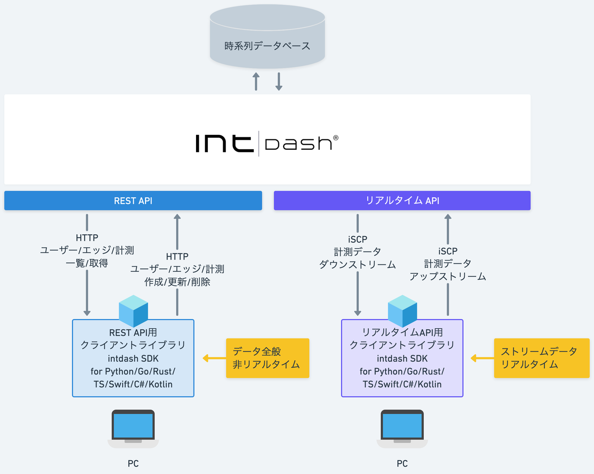

# intdash SDK Beginner's Guide

intdash SDK for Python 入門のサンプルプログラム集です。



## サンプルプログラム
- [SDK入門①〜社用車で走ったとこ全部見せます〜](./lesson1/docs/README.md) 
- [SDK入門②〜データ移行ツールの作り方〜](./lesson2/docs/README.md) 
- [SDK入門③〜RTSPで映像配信するぞ〜](./lesson3/docs/README.md)
- [SDK入門④〜YOLOで物体検知しちゃう〜](./lesson4/docs/README.md)
- [SDK入門⑤〜iPadでData Visualizerを見る会〜](./lesson5/docs/README.md)
- [SDK入門⑥〜最速最高度で計測する日〜](./lesson6/docs/README.md)

## インストール
```
git clone https://github.com/k-ise/intdash-sdk-beginner.git
```
