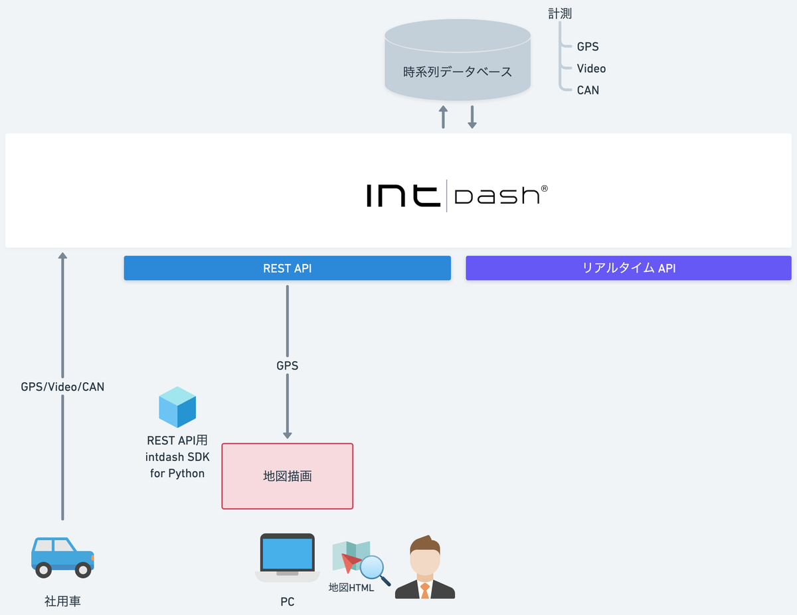
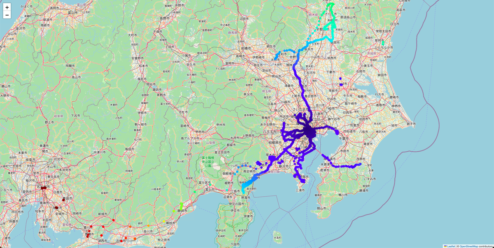

# SDK入門①〜社用車で走ったとこ全部見せます〜

複数エッジのすべての過去計測のGPSデータを取得して地図上にプロットします。






## 依存関係
- REST API用intdash SDK for Python>=v2.7.0
- pydantic>=2.9.2
- python-dateutil>=2.9.0.post0
- urllib3>=2.2.3
- folium>=0.18.0
- matplotlib>=3.9.2

## インストール

### Javaインストール

#### Mac
```sh
brew install openjdk
java --version
```

#### Ubuntu
WiP

#### Windows
WiP

### npmインストール
```sh
brew install node
npm -v
```
#### Ubuntu
WiP

#### Windows
WiP

### OpenAPI Generatorインストール
```sh
npm install @openapitools/openapi-generator-cli
npx @openapitools/openapi-generator-cli version  
```

### intdash SDK for Python生成
```sh
VERSION=v2.7.0
SRC_DIR="."
./node_modules/.bin/openapi-generator-cli version-manager set 6.1.0
./node_modules/.bin/openapi-generator-cli generate \
-g python -i https://docs.intdash.jp/api/intdash-api/${VERSION}/openapi_public.yaml \
    --package-name=intdash \
    --additional-properties=generateSourceCodeOnly=true \
    --global-property=modelTests=false,apiTests=false,modelDocs=true,apiDocs=true \
    --http-user-agent=SDK-Sample-Python-Client/Gen-By-OASGenerator \
    -o "$SRC_DIR"
ls -l intdash
```

### Pythonインストール

#### Mac
```sh
brew install python
python --version
```
#### Ubuntu
WiP

#### Windows
WiP

### Python仮想環境作成
```sh
python3.xx -m venv venv
. ./venv/bin/activate
python --version
pip --version
```
### 依存パッケージインストール
```sh
pip install pydantic python-dateutil urllib3
```

### 利用パッケージインストール
```sh
pip install folium matplotlib
```

## 実行
### PYTHONPATH設定
```sh
echo $PYTHONPATH
export PYTHONPATH=/path/to/your_workspace/intdash:
```

### 実行
```sh
python lesson1/gnss_plot.py --api_url https://example.intdash.jp --api_token <YOUR_API_TOKEN> --project_uuid <YOUR_PROJECT_UUID> --edge_uuids <YOUR_EDGE_UUID1> <YOUR_EDGE_UUID2> <YOUR_EDGE_UUID3>
```

## 詳細
- [SDK入門①〜社用車で走ったとこ全部見せます〜](https://tech.aptpod.co.jp/draft/entry/fnyO710T6NyH29d8ehKXgKYDh48) 

