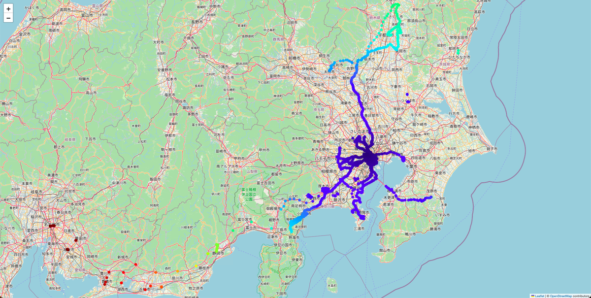

# SDK入門①〜社用車で走ったとこ全部見せます〜

複数エッジのすべての過去計測のGPSデータを取得して地図上にプロットします。

## 依存関係
- REST API用intdash SDK for Python>=v2.7.0
- pydantic>=2.9.2
- python-dateutil>=2.9.0.post0
- urllib3>=2.2.3
- folium>=0.18.0
- matplotlib>=3.9.2

## インストール&実行

- [Mac](./setup_mac.md)

- [Windows](./setup_win.md)

## 詳細
- [SDK入門①〜社用車で走ったとこ全部見せます〜](https://tech.aptpod.co.jp/entry/2024/11/25/170000) 

