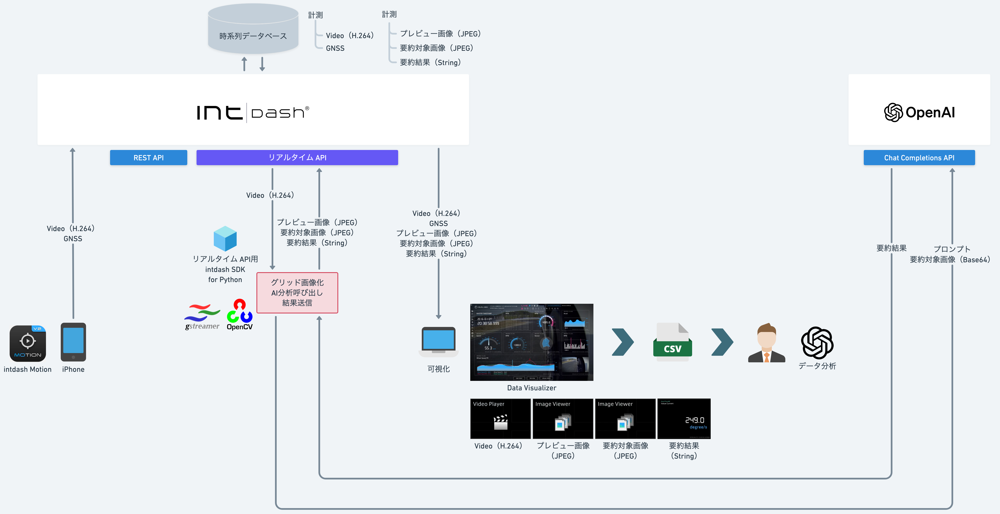
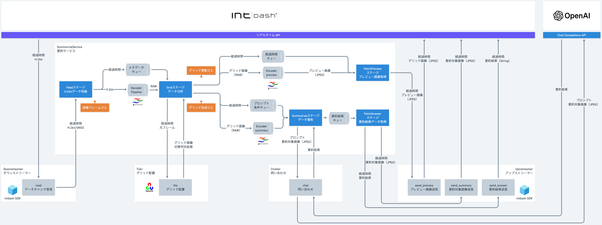
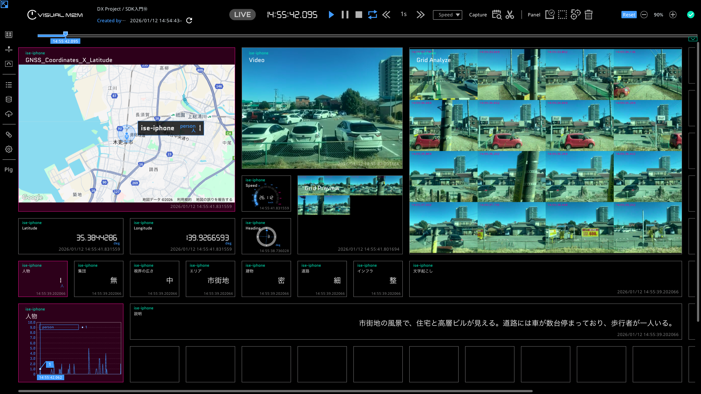

# SDK入門⑩〜ぶらり生成AI分析の旅〜

映像データをダウンストリームしてグリッド画像化、生成AIの要約結果をアップストリームします。

## 依存関係
- REST API用intdash SDK for Python>=v2.7.0
- pydantic>=2.9.2
- python-dateutil>=2.9.0.post0
- urllib3>=2.2.3
- iscp>=1.0.0
- opencv-python>=4.10.0.84
- PyGObject>=3.50.0
- openai>=2.1.0

## インストール&実行

- [Mac](./setup_mac.md)

- [Windows](./setup_win.md)

## 詳細
- [SDK入門⑩〜ぶらり生成AI分析の旅〜](https://tech.aptpod.co.jp/draft/entry/vWyX6O_uQkPrpAuxb7vUj2CVZo4) 

