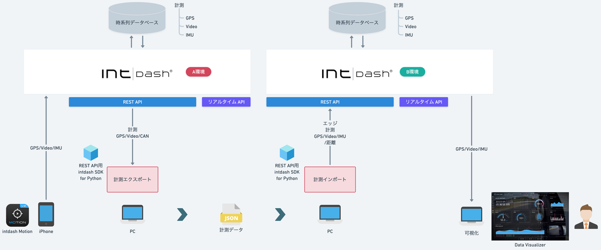
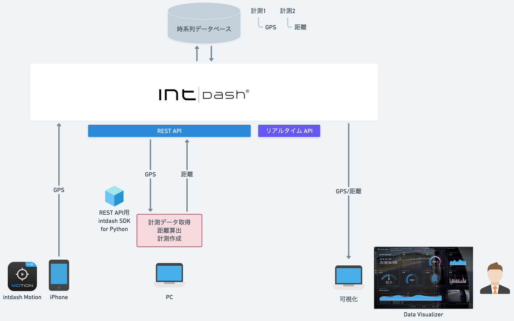
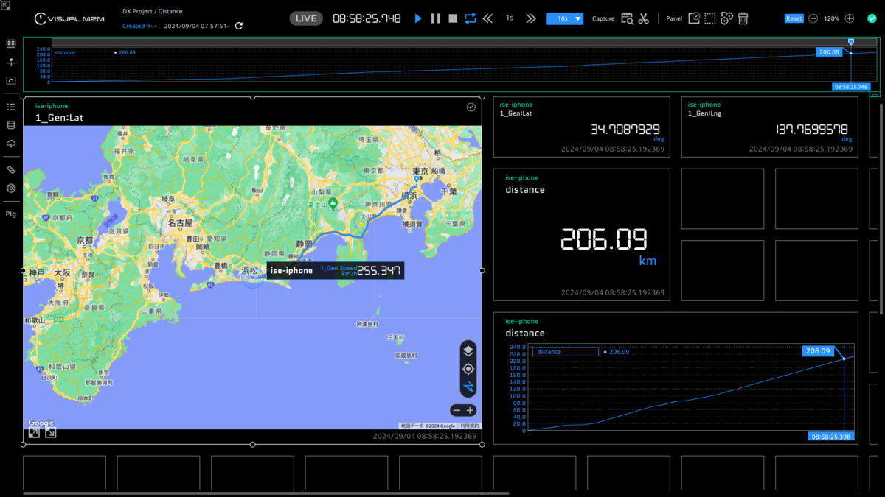

# SDK入門②〜データ移行ツールの作り方〜

- データ移行ツール
  - エクスポート：計測をJSONファイルに出力
  - インポート：JSONファイルから計測を作成



- GPS距離算出
  - 計測のGPSデータと基準点の直線距離を算出して計測として登録




## 依存関係
- REST API用intdash SDK for Python>=v2.7.0
- pydantic>=2.9.2
- python-dateutil>=2.9.0.post0
- urllib3>=2.2.3
- matplotlib>=3.9.2
- Protocol Buffersエンコーダー==intdash.v1
- protobuf>=5.28.3

## インストール
[SDK入門①〜社用車で走ったとこ全部見せます〜](./lesson1/README.md) +

### Buf CLIインストール

#### Mac
```sh
brew install bufbuild/buf/buf
buf --version
```

#### Ubuntu
WiP

#### Windows
WiP

### Protocol Buffersエンコーダーの生成

#### プロトコル定義ファイルのダウンロード
[intdash API specificationページ](https://docs.intdash.jp/api/intdash-api/v2.7.0/spec_public.html#tag/MeasurementService_Measurement-Sequences/operation/createProjectMeasurementSequenceChunks)から[プロトコル定義ファイルページ](https://docs.intdash.jp/api/measurement/v1.18/proto/index.html)に遷移し、プロトコル定義ファイル `protocol.proto` をダウンロードします。


#### プロトコル定義ファイル配置
#### Mac/Ubuntu
```sh
mkdir -p proto/intdash/v1/ 
cp path/to/protocol.proto proto/intdash/v1/  
sed -i -e "s/package pb;/package intdash.v1;/g" proto/intdash/v1/protocol.proto
```

#### Windows
WiP

#### Buf CLI定義ファイル作成
#### Mac/Ubuntu


```sh
cat << EOS > ./proto/buf.yaml
version: v1
breaking:
  use:
    - FILE
lint:
  use:
    - DEFAULT
EOS

cat << EOS > ./buf.gen.yaml
version: v1
managed:
  enabled: true
plugins:
  - plugin: buf.build/protocolbuffers/python:v23.4
    out: gen
EOS

buf generate proto
ls -l gen
```
#### Windows
WiP

### protobufパッケージインストール
```sh
pip install protobuf
```

## 実行
### PYTHONPATH設定
```sh
echo $PYTHONPATH
export PYTHONPATH=/path/to/your_workspace/intdash:
```

### データ移行ツール
#### エクスポート
```sh
python lesson2/migrate/meas_export.py--api_url https://example.intdash.jp --api_token <YOUR_API_TOKEN> --project_uuid <YOUR_PROJECT_UUID> --meas_uuid <YOUR_MEAS_UUID>
```

#### インポート
```sh
python lesson2/migrate/meas_import.py --api_url https://example.intdash.jp --api_token <YOUR_API_TOKEN> --project_uuid <YOUR_PROJECT_UUID> --edge_uuid <YOUR_EDGE_UUID> --src_file <EXPORTED_JSON_FILE>
```

### GPS距離算出
```sh
python lesson2/distance/distance.py --api_url https://example.intdash.jp --api_token <YOUR_API_TOKEN> --project_uuid <YOUR_PROJECT_UUID> --meas_uuid <YOUR_MEAS_UUID>
```

### 可視化
- GPS距離算出
Data Visualizerに[Datファイル](../dat/lesson2/Distance.dat)をインポート

## 詳細
- [SDK入門②〜データ移行ツールの作り方〜](https://tech.aptpod.co.jp/draft/entry/HEcpETLMen5HLiHhUngqNgaHwIE)

