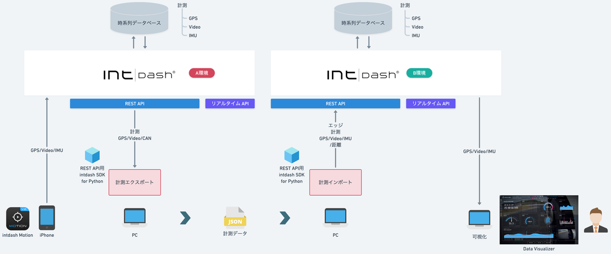
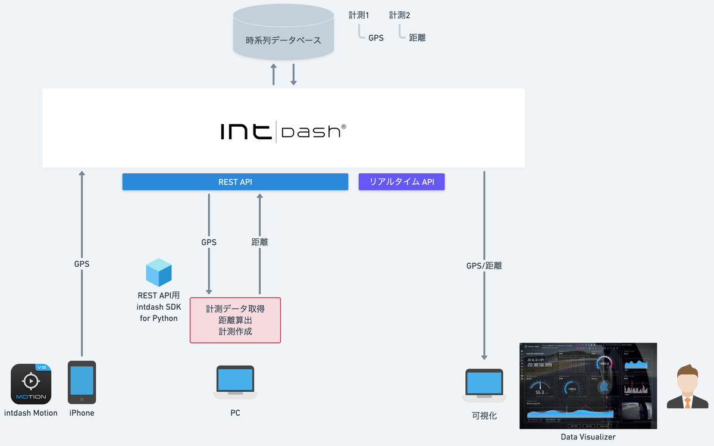
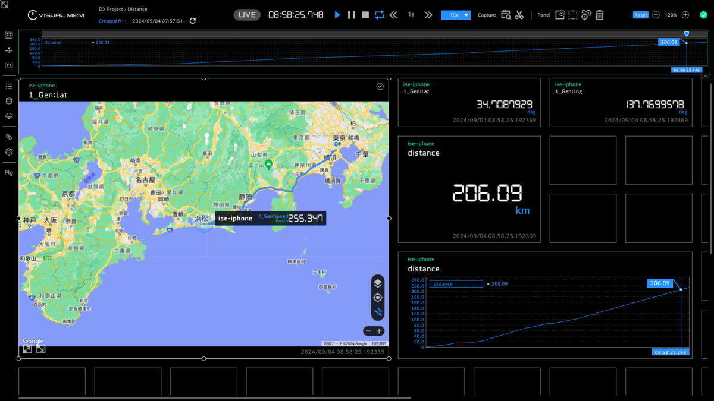

# SDK入門②〜データ移行ツールの作り方〜

- データ移行ツール
  - エクスポート：計測をJSONファイルに出力
  - インポート：JSONファイルから計測を作成

- GPS距離算出
  - 計測のGPSデータと基準点の直線距離を算出して計測として登録

## 依存関係
- REST API用intdash SDK for Python>=v2.7.0
- pydantic>=2.9.2
- python-dateutil>=2.9.0.post0
- urllib3>=2.2.3
- matplotlib>=3.9.2
- Protocol Buffersエンコーダー==intdash.v1
- protobuf>=5.28.3

## インストール&実行

- [Mac](./setup_mac.md)

- [Windows](./setup_win.md)

## 詳細
- [SDK入門②〜データ移行ツールの作り方〜](https://tech.aptpod.co.jp/entry/2024/11/27/160000)

