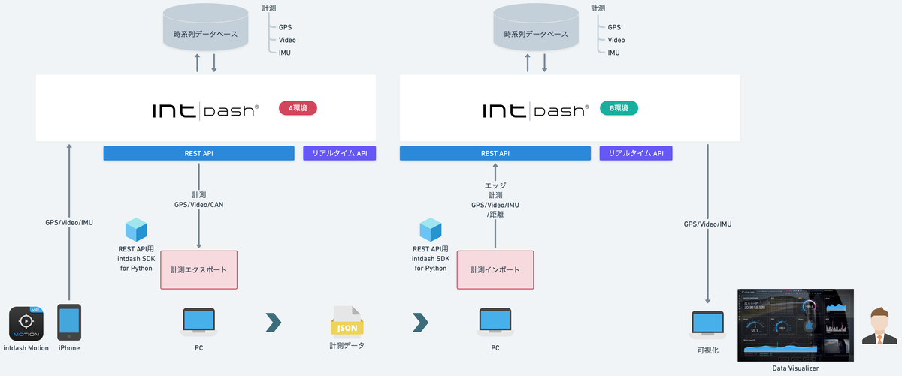
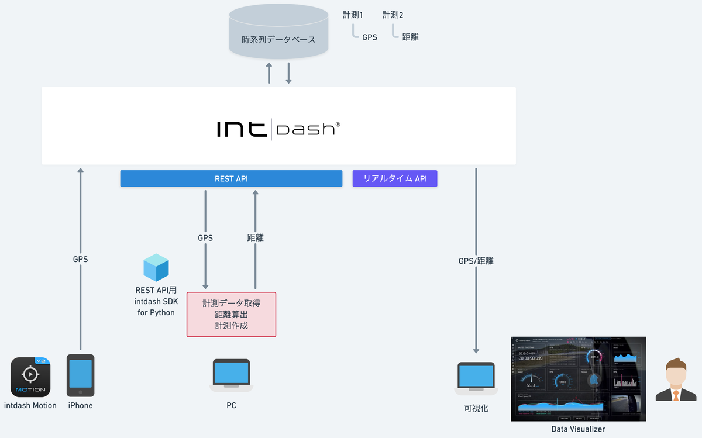
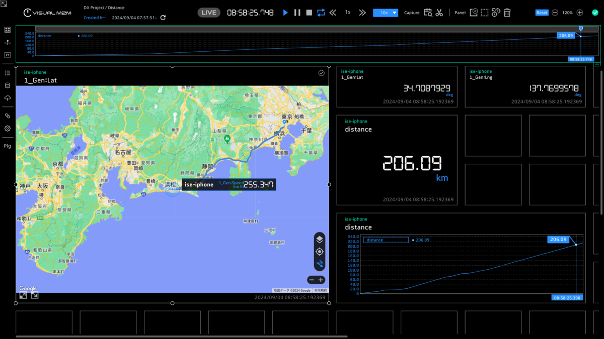

# SDK入門②〜データ移行ツールの作り方〜

- データ移行ツール
  - エクスポート：計測をJSONファイルに出力
  - インポート：JSONファイルから計測を作成

- GPS距離算出
  - 計測のGPSデータと基準点の直線距離を算出して計測として登録

## 依存関係
- REST API用intdash SDK for Python>=v2.7.0
- pydantic>=2.13.4
- python-dateutil>=2.9.0.post0
- urllib3>=2.7.0
- Protocol Buffersエンコーダー==intdash.v1
- protobuf>=7.35.0
- psutil>=7.2.2

## インストール&実行

- [Mac](./setup_mac.md)

- [Windows](./setup_win.md)

## 詳細
- [SDK入門②〜データ移行ツールの作り方〜](https://tech.aptpod.co.jp/entry/2024/11/27/160000)

## 制限
- データ移行ツールのインポート処理は、単一プロセス・単一シーケンスでの投入を前提
- 並列投入や複数計測への分割は、シーケンス番号、データポイント数、エラー時の再実行、サーバー負荷を個別に設計する必要があるため、このサンプルには含めない
- 1リクエストあたりの適切なデータポイント数・protobuf bodyサイズは、データ型、payloadサイズ、サーバー、リバースプロキシ、時系列DBの設定に依存
- iSCP 1.0計測ではList Data Points APIで取得できるデータポイントのJSON表現は、サーバーに登録されている生payloadと同一とは限らない
  - エクスポートしたJSONを別計測へ再登録する場合は、対象データ型ごとにREST APIのJSON表現とiSCP 1.0仕様のpayload形式を確認し、登録バージョンの形式に合わせてpayloadを再構成する
  - 例えば、iSCP v1のCANデータは、CAN IDやチャンネル情報が`data_name`や`data.i`に展開され、`data.d`にはCANデータ部8byteのみが入る場合がある
    - そのため、`data.d`だけを生payloadとして再登録しない
