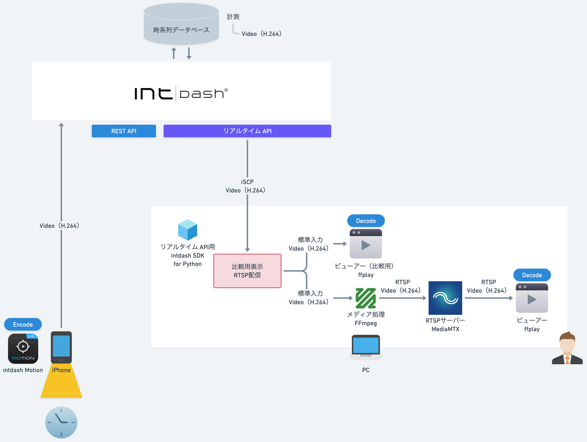

# SDK入門③〜RTSPで映像配信するぞ〜

映像データをダウンストリームしてRTSPで配信します。



## 依存関係
- iscp>=1.0.0

## インストール

### クライアントライブラリインストール
```sh
pip install iscp
```

### FFmpegインストール
#### Mac
```sh
brew install ffmpeg
ffmpeg -version
```
#### Ubuntu
WiP

#### Windows
WiP


### MediaMTXインストール
[MediaMTX](https://github.com/bluenviron/mediamtx?tab=readme-ov-file#installation)のバイナリ（.tar.gz）をダウンロードして展開します。


設定ファイル`mediamtx.yml`を編集して、送信するデータに合わせてFPS設定を変えておきます。

```sh
  rpiCameraFPS: 15
```

## 実行

### MediaMTX
WiP:Windowsはことならないか
```sh
./mediamtx 
```

### PYTHONPATH設定
```sh
echo $PYTHONPATH
export PYTHONPATH=/path/to/your_workspace/intdash:
```

### サンプルプログラム
```sh
python lesson3/rtsp_stream.py  --api_url https://example.intdash.jp --api_token <YOUR_API_TOKEN> --project_uuid <YOUR_PROJECT_UUID> --edge_uuid <YOUR_EDGE_UUID>
```

### 収集開始
[intdash Motion V2](https://apps.apple.com/in/app/intdash-motion-v2/id1632857226)でデータ収集を開始します。

- Data Type: `h264_frame`
- Data Name: `1/h264`

### ffplay
```sh
ffplay -window_title "After RTSP" rtsp://localhost:8554/stream
```

## 詳細
- [SDK入門③〜RTSPで映像配信するぞ〜](https://tech.aptpod.co.jp/draft/entry/53b4Eo4YZD2Da0vuyVJoYmRyN-U) 

