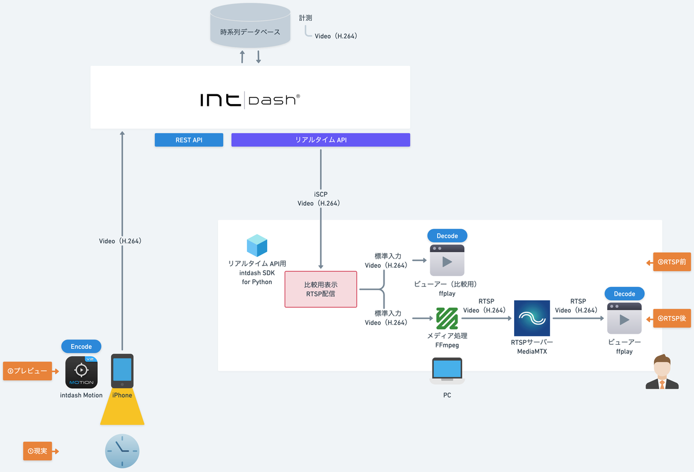

# SDK入門③〜RTSPで映像配信するぞ〜

映像データをダウンストリームしてRTSPで配信します。

## 依存関係
- iscp>=1.0.0

## インストール&実行

- [Mac](./setup_mac.md)

- [Windows](./setup_win.md)

## 詳細
- [SDK入門③〜RTSPで映像配信するぞ〜](https://tech.aptpod.co.jp/entry/2024/11/28/120000) 

