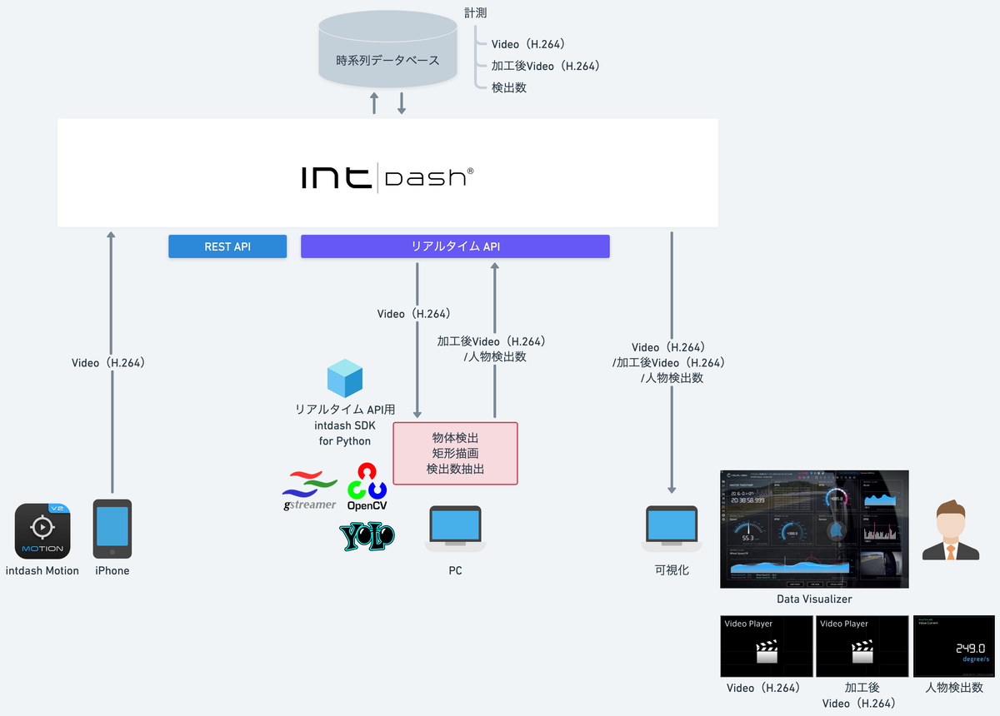
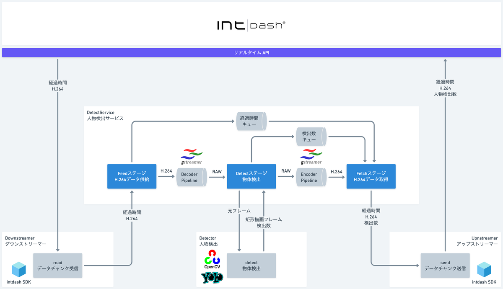

# SDK入門④〜YOLOで物体検知しちゃう〜

ダウンストリームして物体検出した映像データをアップストリームします。





## 依存関係
- REST API用intdash SDK for Python>=v2.7.0
- pydantic>=2.9.2
- python-dateutil>=2.9.0.post0
- urllib3>=2.2.3
- Protocol Buffersエンコーダー==intdash.v1
- protobuf>=5.28.3
- iscp>=1.0.0
- opencv-python>=4.10.0.84
- numpy>=2.1.3
- PyGObject>=3.50.0

## インストール
[SDK入門③〜RTSPで映像配信するぞ〜](./lesson3/README.md) +

### Gstreamerインストール
#### Mac
```sh
brew install gstreamer
```
#### Ubuntu
WiP

#### Windows
WiP

##### Pythonパッケージインストール
```sh
pip install opencv-python numpy PyGObject
```

## 実行

### PYTHONPATH設定
```sh
echo $PYTHONPATH
export PYTHONPATH=/path/to/your_workspace/intdash:
```

### サンプルプログラム
```sh
python lesson4/detect_people.py  --api_url https://example.intdash.jp --api_token <YOUR_API_TOKEN> --project_uuid <YOUR_PROJECT_UUID> --edge_uuid <YOUR_EDGE_UUID>
```

### 収集開始
[intdash Motion V2](https://apps.apple.com/in/app/intdash-motion-v2/id1632857226)でデータ収集を開始します。

- Data Type: `h264_frame`
- Data Name: `1/h264`

### 可視化
Data Visualizerに[Datファイル](../dat/lesson4/Detect%20People.dat)をインポート

## 詳細
- [SDK入門④〜YOLOで物体検知しちゃう〜](https://tech.aptpod.co.jp/draft/entry/kFamFgYj1j6yESIt_ptjPQVmPAE) 

