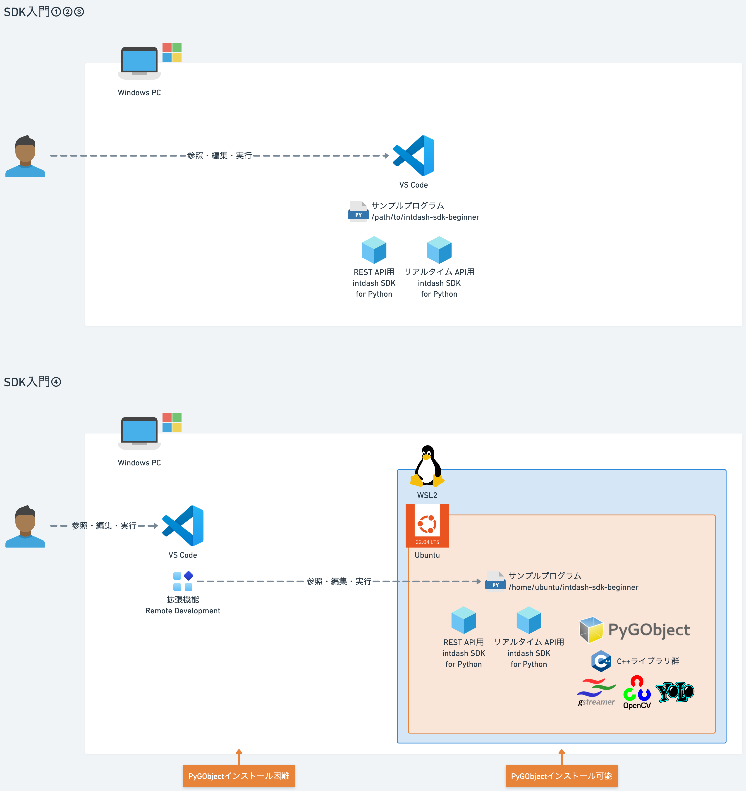

# Windows 

## 前提
### WSLの利用
- WindowsではGstreamerのPythonバインディングであるPyGObjectのサポートが不完全で、インストールやビルドが困難な場合があります。
  - PyGObjectは、gobject-introspectionやglibなどのCライブラリに依存しており、Windowsでの環境構築が煩雑なためです。
  - Meson/Ninja/pkg-configに加え、Visual Studio C++ Build Toolsなどのセットアップが必要ですが、これらがうまく連携せずにビルドが失敗します。
- WSL2（Windows Subsystem for Linux 2）上にUbuntu環境を建ててサンプルプログラムを実行します。
- 開発環境としてVS Codeを使用する場合、リモート開発機能（Remote-WSL拡張）を使ってUbuntu上のファイルをそのまま編集・実行できます。
  - 開発環境VS Codeはリモート開発プロジェクトとしてUbuntu内のサンプルプログラムを参照・実行します。
- WSL環境では、ローカルのWindows環境より操作・動作が遅い場合があります。



## インストール

### WSLインストール

```powershell
wsl --install
wsl --set-default-version 2
```
- Windows再起動

### Ubuntu 22.04インストール
- Microsoft StoreでUbuntu 22.04.5 LTSを入手・インストールします。

### Javaインストール
```sh
java --version
sudo apt update
sudo apt install -y openjdk-17-jdk
```

### npmインストール
```sh
npm -v
curl -o- https://raw.githubusercontent.com/nvm-sh/nvm/v0.39.7/install.sh | bash
source ~/.bashrc
nvm install --lts
nvm use --lts
```

### OpenAPI Generatorインストール
```sh
npm install @openapitools/openapi-generator-cli
npx @openapitools/openapi-generator-cli version
```

### REST API intdash SDK for Python生成
```sh
VERSION=v2.7.0
SRC_DIR="."
./node_modules/.bin/openapi-generator-cli version-manager set 6.1.0
./node_modules/.bin/openapi-generator-cli generate \
-g python -i https://docs.intdash.jp/api/intdash-api/${VERSION}/openapi_public.yaml \
    --package-name=intdash \
    --additional-properties=generateSourceCodeOnly=true \
    --global-property=modelTests=false,apiTests=false,modelDocs=true,apiDocs=true \
    --http-user-agent=SDK-Sample-Python-Client/Gen-By-OASGenerator \
    -o "$SRC_DIR"
ls -l intdash
```

### Gstreamerインストール
```sh
sudo apt install -y gstreamer1.0-tools gstreamer1.0-plugins-base \
  gstreamer1.0-plugins-good gstreamer1.0-plugins-bad gstreamer1.0-plugins-ugly \
  gstreamer1.0-libav
```

### Pythonインストール
```sh
python --version
sudo apt update
sudo apt install -y python3 python3-pip python3-venv python-is-python3
```

### Python仮想環境作成
```sh
python -m venv venv
. venv/bin/activate
python --version
pip --version
```

### PyGObjectインストール
```sh
sudo apt install python3-gi gir1.2-gstreamer-1.0
ln -s /usr/lib/python3/dist-packages/gi venv/lib/python3.10/site-packages/gi
ln -s /usr/lib/python3/dist-packages/pygtkcompat venv/lib/python3.10/site-packages/pygtkcompat
```

### 依存パッケージインストール
```sh
pip install pydantic python-dateutil urllib3
```

### リアルタイムAPI intdash SDK for Pythonインストール
```sh
pip install iscp
```
### 利用パッケージインストール
```sh
pip install opencv-python numpy
```

## 実行

### PYTHONPATH設定
```sh
echo $PYTHONPATH
export PYTHONPATH=/path/to/your_workspace
```

### サンプルプログラム
```sh
python lesson4/src/detect_people.py --api_url https://example.intdash.jp --api_token <YOUR_API_TOKEN> --project_uuid <YOUR_PROJECT_UUID> --edge_uuid <YOUR_EDGE_UUID> --dst_edge_uuid <YOUR_DST_EDGE_UUID>
```

### 収集開始
[intdash Motion V2](https://apps.apple.com/in/app/intdash-motion-v2/id1632857226)でデータ収集を開始します。

- Video
  - <YOUR_EDGE_UUID>
  - Data Type: `h264_frame`
  - Data Name: `1/h264`


### 可視化
Data Visualizerに[Datファイル](../dat/Detect%20People.dat)をインポート
- Video
  - <YOUR_EDGE_UUID>
  - Data Type: `h264_frame`
  - Data Name: `10/h264`
