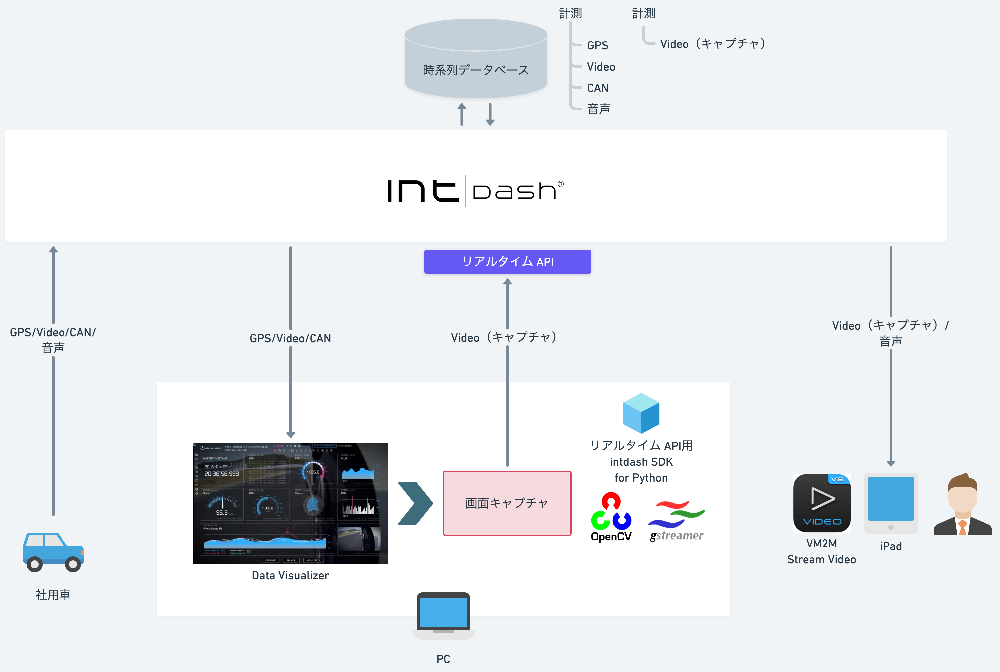
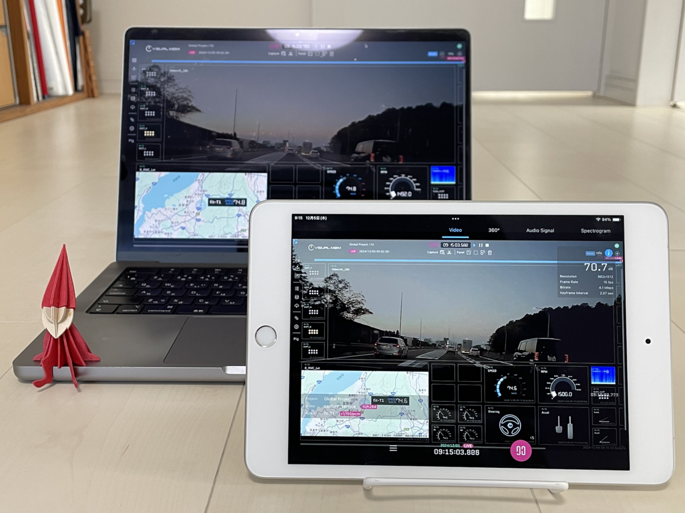

# SDK入門⑤〜iPadでData Visualizerを見る会〜

PCの画面キャプチャしてアップストリームします。

## 依存関係
- REST API用intdash SDK for Python>=v2.7.0
- pydantic>=2.9.2
- python-dateutil>=2.9.0.post0
- urllib3>=2.2.3
- iscp>=1.0.0
- opencv-python>=4.10.0.84
- numpy>=2.1.3
- PyGObject>=3.50.0
- mss>=10.0.0

## インストール&実行

- [Mac](./setup_mac.md)

- [Windows](./setup_win.md)

## 詳細
- [SDK入門⑤〜iPadでData Visualizerを見る会〜](https://tech.aptpod.co.jp/entry/2024/12/20/100000) 

