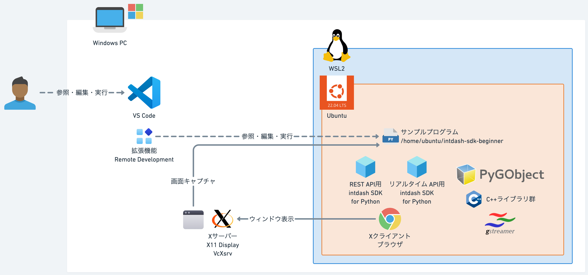

# Windows 

## 前提
### WSLの利用
- WindowsではGstreamerのPythonバインディングであるPyGObjectのサポートが不完全で、インストールやビルドが困難な場合があります。
  - PyGObjectは、gobject-introspectionやglibなどのCライブラリに依存しており、Windowsでの環境構築が煩雑なためです。
  - Meson/Ninja/pkg-configに加え、Visual Studio C++ Build Toolsなどのセットアップが必要ですが、これらがうまく連携せずにビルドが失敗します。
- WSL2（Windows Subsystem for Linux 2）上にUbuntu環境を建ててサンプルプログラムを実行します。
- 開発環境としてVS Codeを使用する場合、リモート開発機能（Remote-WSL拡張）を使ってUbuntu上のファイルをそのまま編集・実行できます。
  - 開発環境VS Codeはリモート開発プロジェクトとしてUbuntu内のサンプルプログラムを参照・実行します。
- WSL環境では、ローカルのWindows環境より操作・動作が遅い場合があります。
- キャプチャするウィンドウを表示するため、XサーバーをWindows側に起動します。
  - XサーバーとしてVcXsrvを利用します。



## インストール
[SDK入門④〜YOLOで物体検知しちゃう〜](../../lesson4/docs/setup_win.md) +

### VcXsrvインストール
[SourceForge](https://sourceforge.net/projects/vcxsrv/)からダウンロード・起動します。
- Multiple windows
- Start no client
- Disable access control

### Xクライアント設定
- WindowsのIPを環境変数`DISPLAY`に設定（WSLからWindows側VcXsrvに接続）
```sh
export DISPLAY=x.x.x.x:0
export LIBGL_ALWAYS_INDIRECT=1
```
- 接続確認
```sh
xdpyinfo | head
```

### ブラウザインストール・起動
- サンプルプログラムと別ウィンドウで実行
```sh
sudo add-apt-repository ppa:savoury1/chromium
sudo apt update
sudo apt install chromium-browser
chromium-browser
```

### Pythonパッケージインストール
```sh
pip install mss
```

## 実行

### PYTHONPATH設定
```sh
echo $PYTHONPATH
export PYTHONPATH=/path/to/your_workspace
```

### サンプルプログラム
#### モニタ全体
```sh
python lesson5/src/capture_screen.py --api_url https://example.intdash.jp --api_token <YOUR_API_TOKEN> --project_uuid <YOUR_PROJECT_UUID> --edge_uuid <YOUR_EDGE_UUID>
```
#### モニタ番号指定
```sh
python lesson5/src/capture_screen.py --api_url https://example.intdash.jp --api_token <YOUR_API_TOKEN> --project_uuid <YOUR_PROJECT_UUID> --edge_uuid <YOUR_EDGE_UUID> --monitor <YOUR_MONITOR_NUMBER>
```

#### キャプチャ範囲オフセット指定
```sh
python lesson5/src/capture_screen.py --api_url https://example.intdash.jp --api_token <YOUR_API_TOKEN> --project_uuid <YOUR_PROJECT_UUID> --edge_uuid <YOUR_EDGE_UUID> --x <OFFSET_X> --y <OFFSET_Y>
```

#### キャプチャ範囲オフセット・幅・高さ指定
```sh
python lesson5/src/capture_screen.py --api_url https://example.intdash.jp --api_token <YOUR_API_TOKEN> --project_uuid <YOUR_PROJECT_UUID> --edge_uuid <YOUR_EDGE_UUID> --x <OFFSET_X> --y <OFFSET_Y> --w <WIDTH> --h <HEIGHT>
```

#### リサイズ幅・高さ指定
```sh
python lesson5/src/capture_screen.py --api_url https://example.intdash.jp --api_token <YOUR_API_TOKEN> --project_uuid <YOUR_PROJECT_UUID> --edge_uuid <YOUR_EDGE_UUID> --up_w <UPSTREAM_WIDTH> --up_h <UPSTREAM_HEIGHT>
```

### 可視化
[VM2M Stream Video V2](https://apps.apple.com/jp/app/vm2m-stream-video-v2/id1640464463)で再生します。

- Video
  - <YOUR_EDGE_UUID>
  - Data Type: `h264_frame`
  - Data Name: `1/h264`
