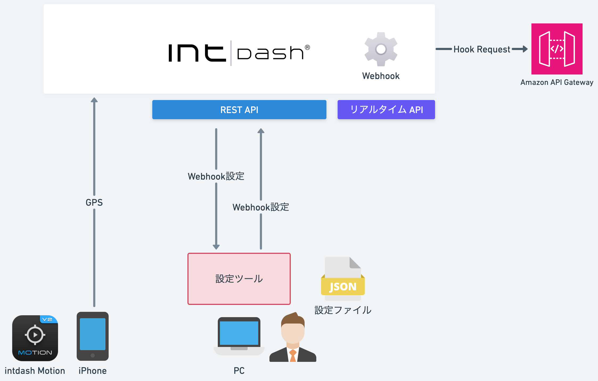
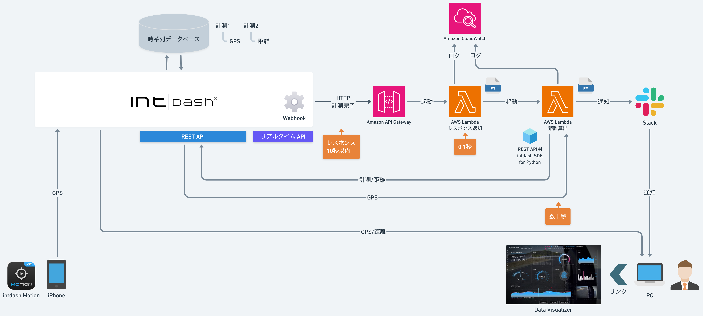
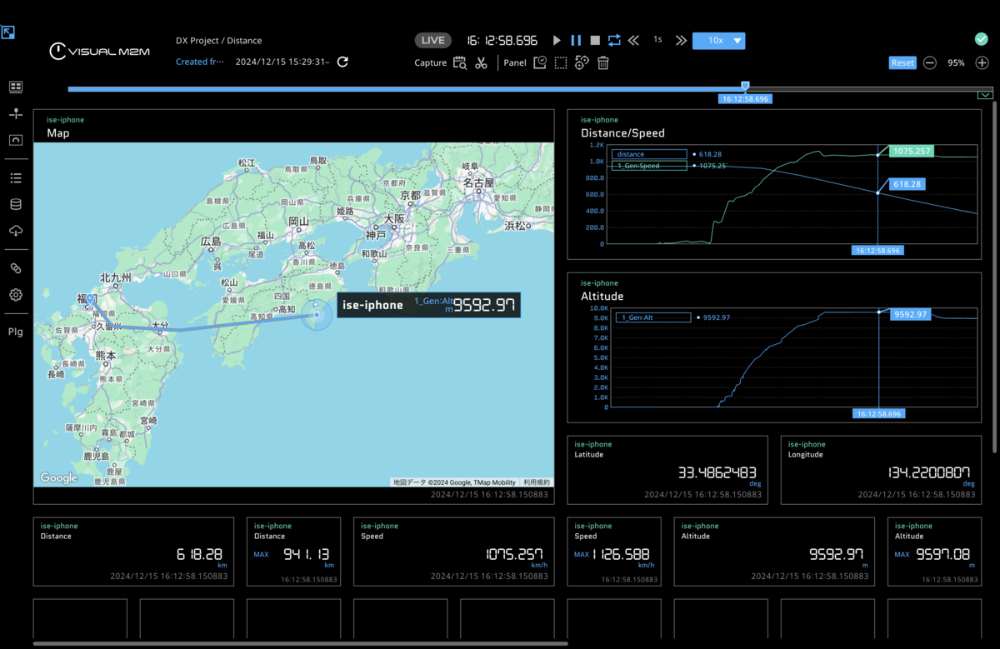

# SDK入門⑥〜最速最高度で計測する日〜

- 設定ツール
  - REST APIでWebhook設定を参照・更新します。

- 距離算出
  - 計測完了でWebhookしてAWS Lambdaで算出距離を登録します。

## 依存関係
- REST API用intdash SDK for Python>=v2.7.0
- pydantic>=2.9.2
- python-dateutil>=2.9.0.post0
- urllib3>=2.2.3
- Protocol Buffersエンコーダー==intdash.v1
- protobuf>=5.28.3
- boto3>=1.35.83
- requests>=2.32.3
- types-requests>=2.32.0.20241016
- pytest>=8.3.4

## インストール&実行

- [Mac](./setup_mac.md)

- [Windows](./setup_win.md)

## 詳細
- [SDK入門⑥〜最速最高度で計測する日〜](https://tech.aptpod.co.jp/entry/2025/01/28/100000) 

