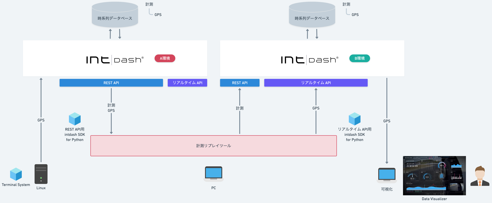
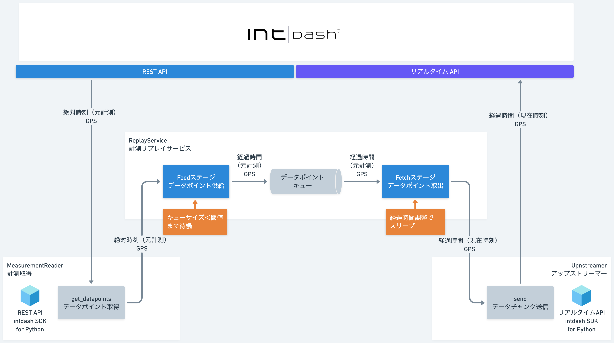

# SDK入門⑦〜計測リプレイツールの作り方〜

過去の計測データを取得して、新規計測としてアップストリームします。

## 依存関係
- REST API用intdash SDK for Python>=v2.7.0
- pydantic>=2.9.2
- python-dateutil>=2.9.0.post0
- urllib3>=2.2.3
- iscp>=1.0.0

## インストール&実行

- [Mac](./setup_mac.md)

- [Windows](./setup_win.md)

## 詳細
- [SDK入門⑦〜計測リプレイツールの作り方〜](https://tech.aptpod.co.jp/entry/2025/04/04/163000)

