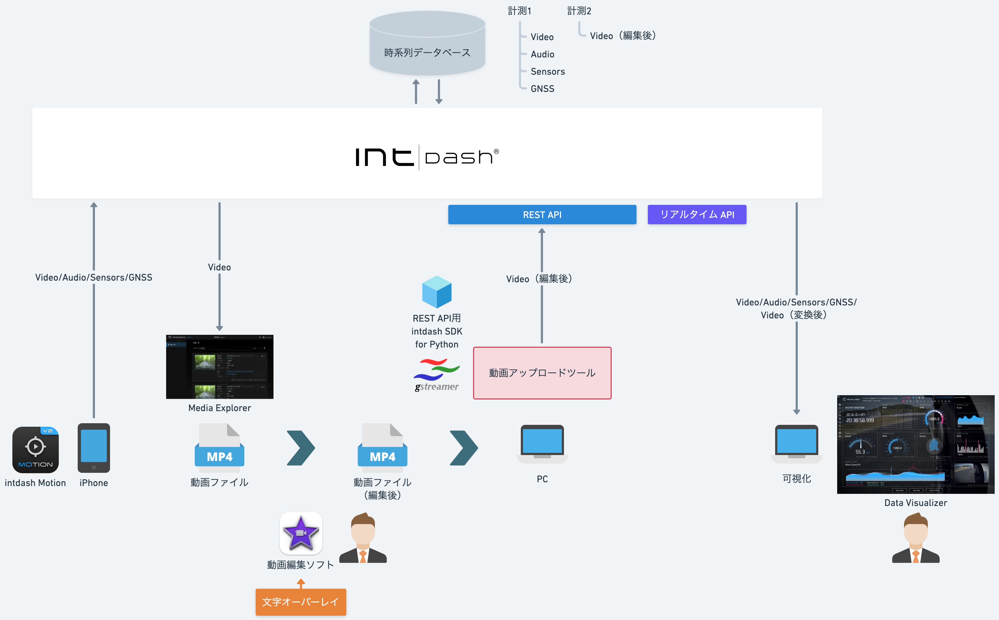
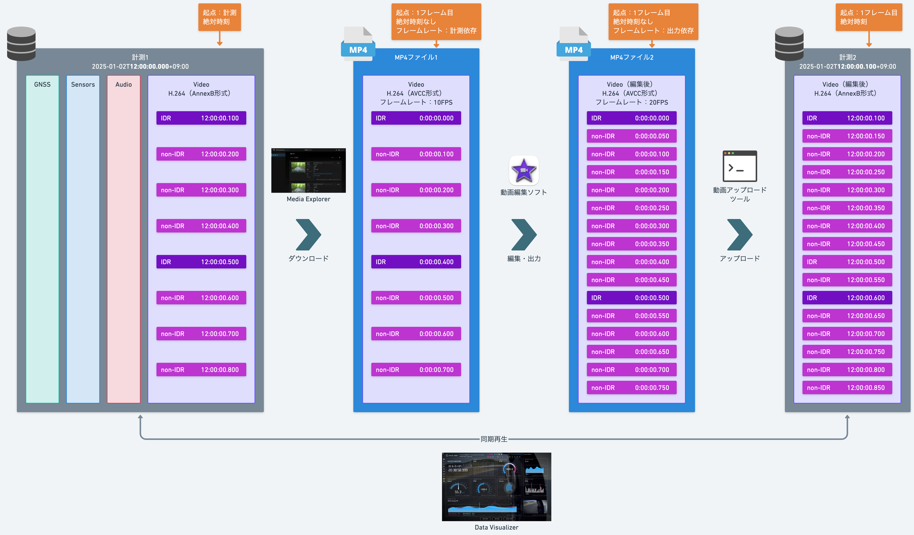
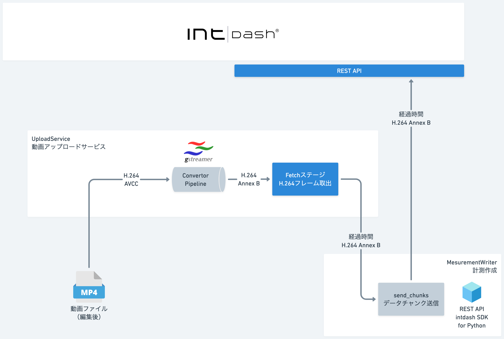

# SDK入門⑧〜動画アップロードツールの作り方〜

MP4ファイルからH.264フレームを読み出して計測として登録します。

## 依存関係
- REST API用intdash SDK for Python>=v2.7.0
- pydantic>=2.9.2
- python-dateutil>=2.9.0.post0
- urllib3>=2.2.3
- Protocol Buffersエンコーダー==intdash.v1
- protobuf>=5.28.3
- PyGObject>=3.50.0

## インストール&実行

- [Mac](./setup_mac.md)

- [Windows](./setup_win.md)

## 詳細
- [SDK入門⑧〜動画アップロードツールの作り方〜](https://tech.aptpod.co.jp/draft/entry/PWfo7k3Ug5qdC5XkWMScV_QeqIA) 
