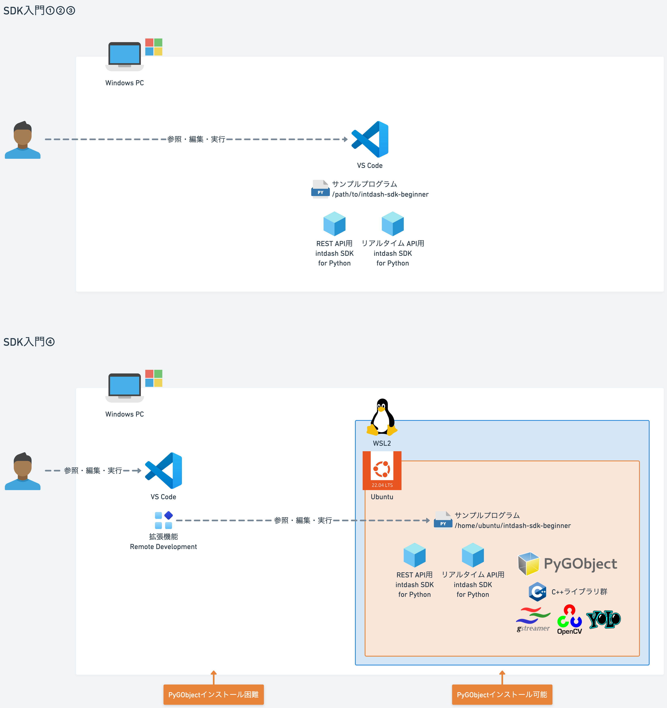

# Windows

## 前提
### WSLの利用
- WindowsではGstreamerのPythonバインディングであるPyGObjectのサポートが不完全で、インストールやビルドが困難な場合があります。
  - PyGObjectは、gobject-introspectionやglibなどのCライブラリに依存しており、Windowsでの環境構築が煩雑なためです。
  - Meson/Ninja/pkg-configに加え、Visual Studio C++ Build Toolsなどのセットアップが必要ですが、これらがうまく連携せずにビルドが失敗します。
- WSL2（Windows Subsystem for Linux 2）上にUbuntu環境を建ててサンプルプログラムを実行します。
- 開発環境としてVS Codeを使用する場合、リモート開発機能（Remote-WSL拡張）を使ってUbuntu上のファイルをそのまま編集・実行できます。
  - 開発環境VS Codeはリモート開発プロジェクトとしてUbuntu内のサンプルプログラムを参照・実行します。
- WSL環境では、ローカルのWindows環境より操作・動作が遅い場合があります。
- キャプチャするウィンドウを表示するため、XサーバーをWindows側に起動します。
  - XサーバーとしてVcXsrvを利用します。



## インストール
[SDK入門①〜社用車で走ったとこ全部見せます〜](../../lesson1/docs/setup_win.md) +<br>
[SDK入門④〜YOLOで物体検知しちゃう〜](../../lesson4/docs/setup_win.md)

### Buf CLIインストール

```sh
sudo apt update
sudo apt install -y curl ca-certificates

VERSION="1.70.0"

curl -sSL \
  "https://github.com/bufbuild/buf/releases/download/v${VERSION}/buf-$(uname -s)-$(uname -m)" \
  -o /tmp/buf

sudo install -m 0755 /tmp/buf /usr/local/bin/buf
rm /tmp/buf

buf --version
```
### Protocol Buffersエンコーダーの生成

#### プロトコル定義ファイルのダウンロード
[intdash API specificationページ](https://docs.intdash.jp/api/intdash-api/v2.7.0/spec_public.html#tag/MeasurementService_Measurement-Sequences/operation/createProjectMeasurementSequenceChunks)から[プロトコル定義ファイルページ](https://docs.intdash.jp/api/measurement/v1.18/proto/index.html)に遷移し、プロトコル定義ファイル `protocol.proto` をダウンロードします。


#### プロトコル定義ファイル配置
```sh
mkdir -p proto/intdash/v1/ 
cp path/to/protocol.proto proto/intdash/v1/  
sed -i -e "s/package pb;/package intdash.v1;/g" proto/intdash/v1/protocol.proto
```

#### Buf CLI定義ファイル作成
```sh
cat << EOS > ./proto/buf.yaml
version: v1
breaking:
  use:
    - FILE
lint:
  use:
    - DEFAULT
EOS

cat << EOS > ./buf.gen.yaml
version: v1
managed:
  enabled: true
plugins:
  - plugin: buf.build/protocolbuffers/python:v23.4
    out: gen
EOS

buf generate proto
ls -l gen
```
### protobufパッケージインストール
```sh
pip install protobuf
```

## 実行

### PYTHONPATH設定
```powershell
echo $PYTHONPATH
export PYTHONPATH=/path/to/your_workspace
```

### サンプルプログラム
#### データ名=`video/h264` 基準時刻=現在時刻
```powershell
python lesson8/src/upload.py --api_url https://example.intdash.jp --api_token <YOUR_API_TOKEN> --project_uuid <YOUR_PROJECT_UUID> --edge_uuid <YOUR_EDGE_UUID> --src_path <YOUR_MP4FILE>
```

#### データ名指定
```powershell
python lesson8/src/upload.py --api_url https://example.intdash.jp --api_token <YOUR_API_TOKEN> --project_uuid <YOUR_PROJECT_UUID> --edge_uuid <YOUR_EDGE_UUID> --src_path <YOUR_MP4FILE> --data_name <YOUR_DATA_NAME>
```

#### 基準時刻指定
```powershell
python lesson8/src/upload.py --api_url https://example.intdash.jp --api_token <YOUR_API_TOKEN> --project_uuid <YOUR_PROJECT_UUID> --edge_uuid <YOUR_EDGE_UUID> --src_path <YOUR_MP4FILE> --basetime <YOUR_BASETIME>
```

### 可視化
Data Visualizerに[Datファイル](../dat/Video.dat)をインポート
- Video
  - <YOUR_EDGE_UUID>
  - Data Type: `h264_frame`
  - Data Name: `video/h264`
  - Data Name: `video/h264` or `--basetime`で指定したデータ名
