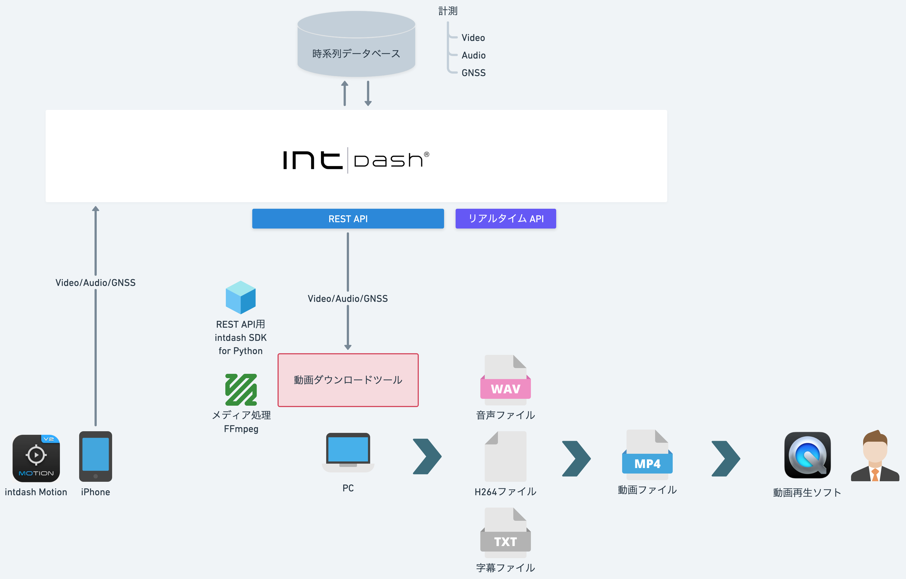
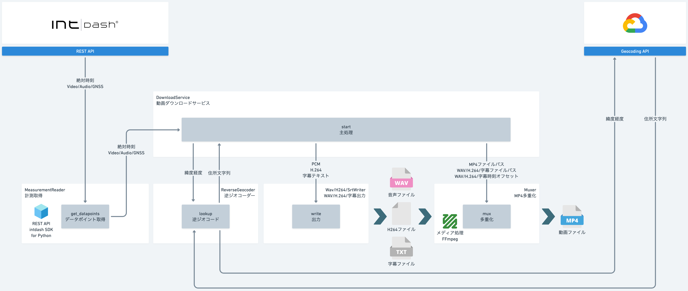

# SDK入門⑨〜動画ダウンロードツールの作り方〜

Audio/Video/GNSSデータを取得して、WAV/H.264/字幕ファイルとして出力します。

## 依存関係
- REST API用intdash SDK for Python>=v2.7.0
- pydantic>=2.9.2
- python-dateutil>=2.9.0.post0
- urllib3>=2.2.3
- numpy>=2.2.1
- requests>=2.32.3

## インストール&実行

- [Mac](./setup_mac.md)

- [Windows](./setup_win.md)

## 詳細
- [SDK入門⑨〜動画ダウンロードツールの作り方〜](https://tech.aptpod.co.jp/draft/entry/A8XSqCWkh5I5Xnn4RVQDD53you0) 

## 制限
- iSCPv1の計測は非対応
- 音声データはS16LE（16bit Integer Little Endian）のみ対応
- 映像データはH.264のみ対応
- 映像データが欠落しているると、欠落フレーム分が詰められて音声とズレます
- Windows Media PlayerはMP4の字幕トラックに対応していません
